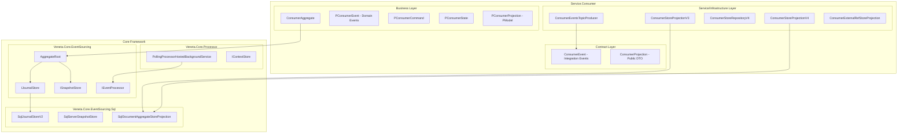
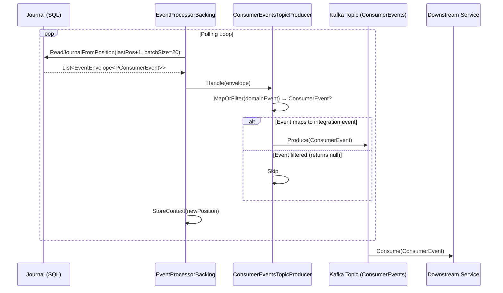
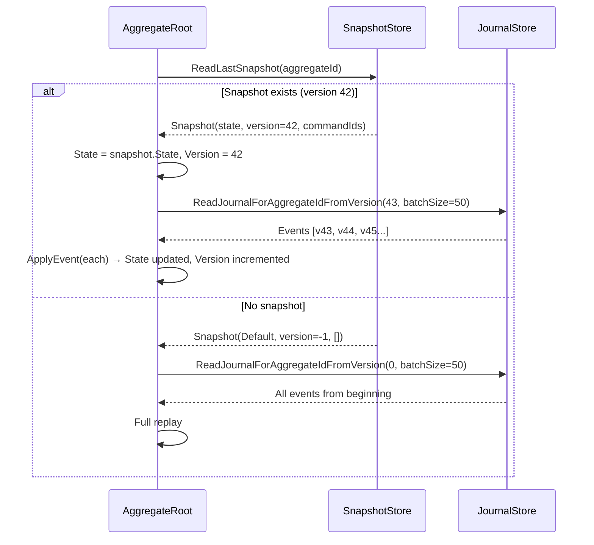
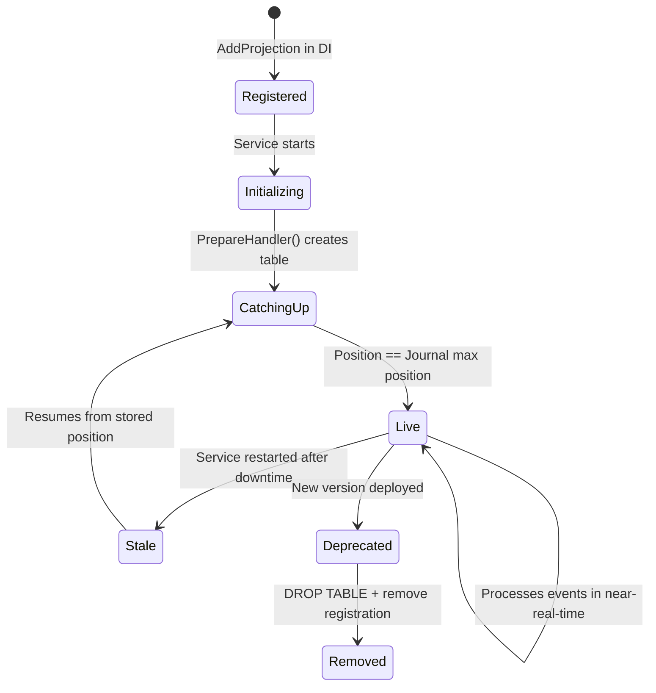

# Event Sourcing in Platform.Ecommerce
## Complete Engineer's Guide — From Zero to Proficient

---

## 0. Quick-Start Mental Model

### What Problem Does Event Sourcing Solve?

In traditional CRUD systems, you store the **current state** of your data. Every UPDATE destroys the previous state. You lose the "how did we get here?" story.

Event Sourcing flips this: you store **every change as an immutable fact** (an event). The current state is derived by replaying those facts. This gives you:

- **Complete audit trail** — every state transition is recorded forever
- **Temporal queries** — "what did this consumer look like on March 3rd?"
- **No data loss** — events are append-only, never deleted or modified
- **Decoupled read models** — build unlimited query-optimized projections from the same event stream
- **Debugging superpower** — replay events to reproduce any bug in any environment

### Three Core Pillars

| Pillar | What It Does | Key Class |
|--------|-------------|-----------|
| **Events as Facts** | Immutable records of what happened | `IAggregateEvent<TEvent>` |
| **Projections as Views** | Query-optimized read models built from events | `SqlDocumentAggregateStoreProjection` |
| **Processors as Async Machines** | Background workers that consume events sequentially | `EventProcessorBacking<T, TEvent>` |

### System Diagram

```
┌─────────────────────────────────────────────────────────────────────────────┐
│                          WRITE SIDE (Command Path)                           │
│                                                                             │
│  HTTP Request → Controller → MediatR Handler → AggregateRoot.Ask(cmd)      │
│                                                      │                      │
│                                          ┌───────────┴───────────┐          │
│                                          │   Load Aggregate      │          │
│                                          │   (Snapshot + Replay) │          │
│                                          └───────────┬───────────┘          │
│                                                      │                      │
│                                          ┌───────────┴───────────┐          │
│                                          │  Aggregate.Behaviour  │          │
│                                          │  state + cmd → Effect │          │
│                                          └───────────┬───────────┘          │
│                                                      │                      │
│                                          ┌───────────┴───────────┐          │
│                                          │  JournalStore.Append  │          │
│                                          │  (optimistic concur.) │          │
│                                          └───────────┬───────────┘          │
│                                                      ▼                      │
│                                              ┌──────────────┐               │
│                                              │  SQL Journal  │               │
│                                              │  (Event Log)  │               │
│                                              └──────┬───────┘               │
└─────────────────────────────────────────────────────┼───────────────────────┘
                                                      │
                        ┌─────────────────────────────┼─────────────────────┐
                        │                             │                     │
                        ▼                             ▼                     ▼
┌───────────────────────────┐  ┌───────────────────────────┐  ┌──────────────────┐
│  READ SIDE: Projection    │  │  READ SIDE: Projection    │  │  INTEGRATION:    │
│  (ConsumerStoreV4)        │  │  (ExternalRefProjection)  │  │  Kafka Producer  │
│                           │  │                           │  │  (TopicProducer) │
│  EventProcessorBacking    │  │  EventProcessorBacking    │  │                  │
│  polls Journal → Apply()  │  │  polls Journal → Apply()  │  │  Domain → Integ. │
│  → Upsert SQL doc store   │  │  → Upsert SQL doc store   │  │  → Kafka Topic   │
└───────────────────────────┘  └───────────────────────────┘  └──────────────────┘
                        │                             │                     │
                        ▼                             ▼                     ▼
              ┌──────────────┐              ┌──────────────┐     ┌──────────────────┐
              │ Projection   │              │ Projection   │     │ Downstream       │
              │ SQL Table    │              │ SQL Table    │     │ Services         │
              │ (Document    │              │ (Document    │     │ (Fulfillment,    │
              │  Store)      │              │  Store)      │     │  Gateway, etc.)  │
              └──────────────┘              └──────────────┘     └──────────────────┘
```

---

## 1. Event Sourcing Theory

### What Is Event Sourcing?

Event Sourcing is an architectural pattern where **state changes are stored as a sequence of events** rather than by overwriting the current state. Each event represents something that happened in the domain — "ConsumerCreated", "AddressUpdated", "AnonymisationRequested".

### Why Use It?

| Concern | CRUD Approach | Event Sourcing Approach |
|---------|--------------|------------------------|
| **Audit** | Add audit table, hope it's complete | Built-in — the event log IS the audit |
| **Temporal Queries** | CDC or temporal tables (complex) | Replay events to any point in time |
| **Schema Evolution** | ALTER TABLE with data migration | Add new projection, replay from scratch |
| **Bug Investigation** | Check logs, hope they're enough | Replay exact event sequence locally |
| **Multiple Read Models** | Maintain multiple synced tables | Each projection is independent |
| **Data Loss** | UPDATE destroys history | Events are immutable, append-only |
| **Concurrency** | Row-level locks, merge conflicts | Optimistic concurrency on stream version |

### How It Works (Simplified)

1. **Command arrives** (e.g., "Update consumer name")
2. **Aggregate loads** — replay events since last snapshot to rebuild current state
3. **Business logic evaluates** — given current state + command → produce event(s) or reject
4. **Events persisted** — appended to the journal with optimistic version check
5. **Processors pick up events** — async background workers poll for new events
6. **Projections updated** — each processor applies events to its read model

### Key Terms — Mapped to Platform.Ecommerce Classes

| Term | Class | Purpose |
|------|-------|---------|
| Aggregate | `Aggregate<TCommand, TEvent, TState>` | Defines behaviour (command→event, event→state) |
| Aggregate Root | `AggregateRoot<TAggregate, TCommand, TEvent, TState>` | Orchestrates load, handle, persist lifecycle |
| Stateless Aggregate Root | `StatelessAggregateRoot<...>` | AggregateRoot that delegates `Ask` directly to `ApplyCommand` |
| Effect | `Effects<TEvent>` | Result of a command: events to persist + reply |
| Reply | `IReply` / `Replies.Accepted` / `Replies.Rejected<T>` | Success/failure signal from command handling |
| Rejection | `IRejection` / `CommandRejectionException` | Typed failure with reason |
| Event | `IAggregateEvent<TEvent>` | Immutable domain fact |
| Event Envelope | `EventEnvelope<TEvent>` | Event + metadata (Position, Version, AggregateId, CreatedAt) |
| Journal Store | `IJournalStore<TEvent>` | Persist and read event streams |
| Snapshot Store | `ISnapshotStore<TState>` | Persist/read aggregate state checkpoints |
| Processor | `IEventProcessor<TEvent>` | Consumes events sequentially |
| Processor Backing | `EventProcessorBacking<T, TEvent>` | Wires processor to polling loop + position tracking |
| Context Store | `IContextStore` | Persists processor position |
| Projection | `SqlDocumentStoreProjection<TEvent, TState>` | Event processor that maintains a SQL document store |
| Aggregate Projection | `SqlDocumentAggregateStoreProjection<TEvent, TState>` | Projection keyed by AggregateId |
| Projection State | `IProjectionState` | Marker: has `Position` to track processed offset |

---

## 2. Architecture Overview

### Mermaid: Bounded Context & Layers



### Integration Event Flow to Kafka



### Layer Responsibilities

| Layer | Contains | Examples |
|-------|----------|----------|
| **Contract** | Public DTOs, integration events, public projection records | `ConsumerEvent`, `ConsumerProjection` |
| **Business** | Aggregate, domain events, commands, state, PModels (projection logic) | `ConsumerAggregate`, `PConsumerEvent`, `PConsumerProjection` |
| **Service** | Infrastructure wiring, concrete projections, repositories, Kafka producers | `ConsumerStoreProjectionV4`, `ConsumerStoreRepositoryV4` |

---

## 3. Core Abstractions Deep Dive

### 3.1 Aggregates

#### Class Hierarchy

```
Aggregate<TCommand, TEvent, TState>           ← Abstract: defines Behaviour() + SnapshottingBehaviour()
    └── [Your domain aggregate, e.g. ConsumerAggregate]

AggregateRoot<TAggregate, TCommand, TEvent, TState>  ← Orchestrates lifecycle
    └── StatelessAggregateRoot<...>                    ← Simple: Ask() calls ApplyCommand()
```

#### How `Aggregate<TCommand, TEvent, TState>` Works

The aggregate is a **pure behaviour definition**. It defines:

1. **`Behaviour()`** — returns a function `TState → Actions` that maps the current state to available command/event handlers
2. **`SnapshottingBehaviour()`** — decides when to take a snapshot

The `Actions` class holds two dictionaries:
- `CommandHandler`: `Dictionary<commandType, (state, cmd) → Effects<TEvent>>`
- `EventHandler`: `Dictionary<eventType, (state, evt) → TState>`

#### The `Then` Helper (Effect Creation)

```csharp
Then.Persist(event)           // Accept + persist one event
Then.PersistAll(events)       // Accept + persist multiple events
Then.Reject("reason")         // Reject command, persist nothing
Then.Accept()                 // Accept command, persist nothing (no-op/idempotent)
```

#### Effects, Replies, and Rejections

```csharp
// Effects<TEvent> = the complete result of handling a command
public record Effects<TEvent>(IReply Reply, IPersistEffect<TEvent> PersistEffect);

// IPersistEffect<TEvent> variants:
PersistNone<TEvent>     // Nothing to store
PersistOne<TEvent>      // Single event
PersistMany<TEvent>     // Multiple events

// IReply variants:
Replies.Accepted        // Command succeeded
Replies.Ignored         // Command intentionally ignored
Replies.Rejected<T>     // Command rejected with typed reason (CommandRejectionException)
```

#### Real Example: ConsumerAggregate Command Handler

```csharp
// State-based dispatch: different states allow different commands
public override Func<PConsumerState, Actions> Behaviour() => consumerState =>
{
    var builder = ActionsBuilder.Create();
    _ = consumerState.Status switch
    {
        PConsumerStatus.NotInitialized => HandleNotInitialized(builder),
        PConsumerStatus.Created => HandleCreated(builder),
        PConsumerStatus.Anonymised => HandleAnonymised(builder),
    };
    // Event handlers always registered (they apply regardless of current state)
    builder.OnEvent<PConsumerEvent.PConsumerCreatedV2>((state, ev) => state with { ... });
    return builder.Build();
};

// A command handler with idempotency check:
private Effects<PConsumerEvent> HandleUpdateName(PConsumerState state, PConsumerCommand.UpdateConsumerName cmd)
{
    if (state.Name == cmd.Name)
        return Then.Accept();  // Idempotent — no event emitted

    return Then.Persist(new PConsumerEvent.PConsumerNameUpdated(...));
}
```

#### AggregateRoot Lifecycle (the orchestrator)

`AggregateRoot` manages the full lifecycle:

1. **`Initialize()`** — loads snapshot + replays events after snapshot version
2. **`ApplyCommand(cmd)`** — runs command through behaviour, persists events, handles concurrency
3. **Command deduplication** — tracks last 100 `CommandId`s to prevent double-processing

```csharp
// Simplified Initialize flow:
public async Task Initialize()
{
    var snapshot = await _snapshotStore.ReadLastSnapshot(AggregateId);
    State = snapshot.State;
    Version = snapshot.CreatedAtVersion;

    // Replay events AFTER the snapshot
    do {
        var result = await _journalStore.ReadJournalForAggregateIdFromVersion(Version.Next(), batchSize: 50);
        foreach (var evt in result.Events) {
            ApplyEvent(evt.Event);  // Updates State via event handler
            Version = evt.Version;
        }
    } while (!result.HasReachedEndOfStream);
}
```

---

### 3.2 Events

#### Class Hierarchy

```
IEvent                          ← Marker (extends IJsonable)
  └── IAggregateEvent           ← Has AggregateTag() method
       └── IAggregateEvent<TE>  ← Generic, typed, has static EventTag
```

#### Concrete Event Pattern (from Service.Consumer)

```csharp
[JsonConverter(typeof(JsonSubtypeConverter))]
public abstract record PConsumerEvent : IAggregateEvent<PConsumerEvent>
{
    public IEventTagger AggregateTag() => EventTag.Of<PConsumerEvent>();

    [JsonSubtype("ConsumerCreatedV2")]
    public record PConsumerCreatedV2(
        PConsumerId ConsumerId,
        PConsumerType ConsumerType,
        PEmail Email,
        PName Name,
        PAddressInfo AddressInfo,
        PCountryCode CountryCode,
        PExternalId? ExternalId,
        PSource Source
    ) : PConsumerEvent;

    [JsonSubtype("ConsumerNameUpdated")]
    public record PConsumerNameUpdated(
        PConsumerId ConsumerId,
        PName Name,
        PCountryCode CountryCode,
        PSource Source
    ) : PConsumerEvent;

    // ... more event types
}
```

> ⚠️ **Watch Out**: The `[JsonSubtype("...")]` attribute is the **type discriminator** stored in JSON. Renaming it breaks deserialization of existing events in the journal!

#### EventEnvelope Structure

```csharp
public record EventEnvelope<TEvent>(
    AggregateId AggregateId,    // Stream identity (e.g., hashed email for consumers)
    TEvent Event,                // The domain event payload
    Position Position,           // Global sequential position in journal
    Version Version,             // Per-aggregate sequential version
    DateTimeOffset CreatedAt,    // When the event was stored
    CommandId? CommandId         // For command deduplication
);
```

- **Position** — global ordering across ALL aggregates (used by processors)
- **Version** — per-stream ordering (used for optimistic concurrency)

#### EventTag, EventTagger, EventShards

These support **parallel processing** and **event routing**:

```csharp
// EventTag — identifies an event type for routing
EventTag.Of<PConsumerEvent>()  // → tag "PConsumerEvent"

// EventShards — distributes aggregates across N shards for parallel processing
EventTag.Sharded<PConsumerEvent>("Consumer", numShards: 4)
// Shard assignment: hash(aggregateId) % numShards

// Get shard for specific aggregate:
shards.ForAggregateId("consumer-123")  // → EventTag("Consumer|2")
```

---

### 3.3 Journal / Event Store

#### IJournalStore Interface

```csharp
public interface IJournalStore<TEvent> : IJournalStore where TEvent : IAggregateEvent<TEvent>
{
    // Read events for a specific aggregate (used during Initialize)
    Task<AggregatePagedResult<TEvent>> ReadJournalForAggregateIdFromVersion(
        AggregateId aggregateId, Version fromVersion, int batchSize);

    // Append events with optimistic concurrency
    Task AppendToJournalForAggregateId(
        AggregateId aggregateId, Version expectedVersion,
        IEnumerable<TEvent> events, CommandId? commandId);

    // Read events globally by position (used by processors)
    Task<PagedResult<TEvent>> ReadJournalFromPosition(Position fromPosition, int batchSize);

    // Read raw JSON payloads (used by diagnostics)
    Task<PagedRawResult> ReadJournalRawFromPosition(Position fromPosition, int batchSize);
}
```

#### SqlJournalStore (V1) vs SqlJournalStoreV2 — Key Differences

| Aspect | V1 (`SqlJournalStore`) | V2 (`SqlJournalStoreV2`) |
|--------|----------------------|------------------------|
| **Position** | Auto-generated by DB (IDENTITY) | Explicitly managed in code |
| **Locking** | DB transaction (Serializable) only | `JournalSemaphore` + DB transaction |
| **Soft Delete** | Not checked in aggregate reads | Supports soft-deleted events (skips them) |
| **Consistency** | No position/version gap detection | Throws `InconsistentPositionException`/`InconsistentVersionException` |
| **Primary Key** | `(AggregateId, EventType, AggregateVersion)` | `Position` (with unique index on aggregate+version) |

**V2 is the default for new services.** V1 remains for backwards compatibility with existing journal tables.

#### SqlServerJournalStore vs SqliteJournalStore

| | SqlServer | SQLite |
|---|-----------|--------|
| **Use** | Production (Azure SQL) | Unit/integration tests |
| **Position** | Explicit BIGINT (V2) or IDENTITY (V1) | INTEGER AUTOINCREMENT |
| **Timestamps** | `GETUTCDATE()` | `UNIXEPOCH()` |
| **Isolation** | Serializable transactions | Serializable transactions |

#### Journal SQL Schema (SQL Server V2)

```sql
CREATE TABLE dbo.Journal
(
    Position          BIGINT NOT NULL,              -- Global sequential order
    Deleted           BIT DEFAULT 0 NOT NULL,       -- Soft delete flag
    EventType         NVARCHAR(256) NOT NULL,       -- Aggregate type discriminator
    EventTag          NVARCHAR(256) NOT NULL,       -- Concrete event type name
    AggregateId       NVARCHAR(256) NOT NULL,       -- Stream identity
    AggregateVersion  INT NOT NULL,                 -- Per-stream version
    EventPayload      NVARCHAR(MAX) NOT NULL,       -- JSON serialized event
    MetaPayload       NVARCHAR(MAX),                -- Optional metadata
    CreatedAt         DATETIME NOT NULL DEFAULT(GETUTCDATE()),
    CommandId         NVARCHAR(256) NULL,           -- For deduplication
    PRIMARY KEY (Position)
);

CREATE UNIQUE INDEX IX_Journal_AggregateId_AggregateVersion_EventType
    ON Journal(AggregateId, AggregateVersion, EventType);
CREATE INDEX IX_Journal_Position_EventType
    ON Journal(Position, EventType);
CREATE INDEX IX_Journal_Position_EventType_Deleted
    ON Journal(Position, EventType, Deleted);
```

#### Optimistic Concurrency: WrongExpectedVersionException

```csharp
// Inside AppendToJournalForAggregateId:
var currentVersion = /* query last version for this aggregate */;
if (currentVersion != expectedVersion)
    throw new WrongExpectedVersionException(expectedVersion, currentVersion);
```

When thrown, `AggregateRoot.ApplyCommand` catches it and returns a rejection:

```csharp
catch (WrongExpectedVersionException e)
{
    await Reset();  // Re-initialize from snapshot + replay
    return Replies.Reject($"Wrong expected version...");
}
```

#### JournalSemaphore — Why In-Process Locking?

```csharp
public class JournalSemaphore
{
    public SemaphoreSlim SemaphoreSlim { get; } = new SemaphoreSlim(1, 1);
}
```

The semaphore prevents **concurrent writes to the same journal table from the same process** (e.g., two MediatR handlers trying to append at the same time). The DB transaction handles cross-process concurrency, but within a single instance, the semaphore avoids connection contention and ensures consistent position calculation in V2.

---

### 3.4 Snapshots

#### Interfaces

```csharp
public interface ISnapshotStore<TState> : ISnapshotStore where TState : IAggregateState<TState>
{
    Task<Snapshot<TState>> ReadLastSnapshot(AggregateId aggregateId);
    Task WriteSnapshot(AggregateId aggregateId, TState state, Version forVersion,
        ImmutableList<CommandId> processedCommandIds);
}

public record Snapshot<TState>(Version CreatedAtVersion, TState State, ImmutableList<CommandId> ProcessedCommandIds);

public interface IAggregateState<T> : IJsonable
{
    abstract static T Default { get; }  // Initial empty state
}
```

#### Snapshotting Behaviour

```csharp
// Version-based: snapshot every N events
public class VersionBasedAggregateSnapshottingBehaviour<TState, TEvent>
{
    public bool ShouldSnapshot(Version currentVersion, Version lastSnapshotVersion, ...)
        => currentVersion.Value - lastSnapshotVersion.Value >= _snapshotAtEvery;
}

// Disabled (used by ConsumerAggregate — streams are short enough)
public class DisabledAggregateSnapshottingBehaviour<TState, TEvent>
{
    public bool ShouldSnapshot(...) => false;
}
```

#### Snapshot SQL Schema

```sql
CREATE TABLE dbo.Snapshots
(
    AggregateId         NVARCHAR(256) NOT NULL,
    SnapshotType        NVARCHAR(256) NOT NULL,      -- typeof(TState).Name
    SnapshotPayload     NVARCHAR(MAX) NOT NULL,      -- JSON serialized state
    AggregateVersion    INT NOT NULL,                -- Version at snapshot time
    ProcessedCommandIds NVARCHAR(MAX) NULL,          -- JSON array of recent CommandIds
    PRIMARY KEY (AggregateId, SnapshotType, AggregateVersion)
);
```

#### Aggregate Rebuild Flow



---

### 3.5 Processors (Veneta.Core.Processor)

#### IEventProcessor Interface

```csharp
public interface IEventProcessor<TEvent> where TEvent : IAggregateEvent<TEvent>
{
    ProcessorId ProcessorId { get; }
    Task PrepareHandler(CancellationToken token);  // Create tables, warm up
    Task Handle(EventEnvelope<TEvent> evt);         // Process one event
}
```

#### EventProcessorBacking — The Engine

`EventProcessorBacking<T, TEvent>` is the bridge between `IEventProcessor` and the polling infrastructure:

```csharp
public async Task Process(CancellationToken cancellationToken)
{
    var context = await PrepareContext();  // Get last processed position
    var events = await _journalStore.ReadJournalFromPosition(context.Next(), BatchSize: 20);

    foreach (var evt in events.Events)
    {
        await _eventProcessor.Handle(evt);           // Process event
        await _contextStore.StoreContextForProcessor(  // Advance position
            _eventProcessor.ProcessorId, evt.Position);
    }

    if (events.HasReachedEndOfStream)
        await Task.Delay(500);  // Back off when caught up
}
```

> ✅ **Key Guarantee**: Position advances ONLY after successful `Handle()`. If processing throws, the position stays — enabling **at-least-once delivery**.

#### Polling Loop (PollingProcessorHostedBackgroundService)

```
┌─────────────────────────────────────────────────┐
│  PollingProcessorHostedBackgroundService<T>      │
│                                                 │
│  1. Wait for health check (DB ready)           │
│  2. Acquire distributed lock (processorId)     │
│  3. Loop:                                      │
│     a. Check IsEnabled()                       │
│     b. Call Process()                          │
│     c. Wait PollingInterval()                  │
│     d. On exception → log + break (backoff)    │
│  4. Release lock                               │
│  5. Backoff 5s → retry from step 2            │
└─────────────────────────────────────────────────┘
```

#### Context Store (SQL-Based Position Persistence)

```sql
CREATE TABLE ContextStorage
(
    ProcessorId  VARCHAR(256) PRIMARY KEY,
    ContextType  VARCHAR(256) NOT NULL,
    Context      NVARCHAR(MAX) NOT NULL   -- JSON: {"Value": 12345}
);
```

The `Context` column stores the serialized `Position` (which is just a `long` wrapper). On restart, the processor reads this to know where to resume.

#### Distributed Lock (MsSqlBasedLock)

When multiple instances of the same service run (e.g., in Kubernetes), only ONE instance should run each processor. The `ILockProvider` (backed by SQL Server `sp_getapplock`) ensures single-active-processor semantics.

---

### 3.6 Projections (SqlDocumentStoreProjection Family)

#### Hierarchy

```
SqlDocumentStoreProjection<TEvent, TState>         ← Base: any document ID
    └── SqlDocumentAggregateStoreProjection<TEvent, TState>  ← Document ID = AggregateId

SqlDocumentStoreProjectionV2<TEvent, TPayload>     ← V2: tracks Position per document
    └── SqlDocumentAggregateStoreProjectionV2<TEvent, TState>  ← V2 + AggregateId key
```

#### V1 vs V2 Differences

| Aspect | V1 (`SqlDocumentStoreProjection`) | V2 (`SqlDocumentStoreProjectionV2`) |
|--------|----------------------------------|-------------------------------------|
| **State type** | Must implement `IProjectionState` | Any `IJsonable` (wrapped in `ProjectionDocument<T>`) |
| **Position tracking** | In the payload (via `IProjectionState.Position`) | Separate `DocumentPosition` column |
| **Table schema** | DocumentId, DocumentType, DocumentPayload, DocumentVersion | DocumentId, DocumentPayload, DocumentVersion, DocumentPosition |
| **Idempotency** | External (caller checks position) | Built-in: skips if `evt.Position <= document.Position` |

#### How SqlDocumentAggregateStoreProjection Works (V1)

```csharp
public override async Task Handle(EventEnvelope<TEvent> evt)
{
    var currentState = await GetCurrentState(evt);  // Load by AggregateId

    // Idempotency: skip already-processed events
    if (currentState != null && evt.Position.Value <= currentState.Position.Value)
        return;

    var newState = Mutate(currentState, evt.Event, evt.Position);  // YOUR LOGIC

    if (newState == null)        // Mutate returns null → delete document
        await Delete(evt);
    else
        await Upsert(evt, newState, currentState);  // Insert or update
}
```

#### Projection Table SQL Schema

```sql
-- V1 schema
CREATE TABLE dbo.ConsumerProjectionV4
(
    DocumentId      NVARCHAR(256) NOT NULL PRIMARY KEY,  -- = AggregateId
    DocumentType    NVARCHAR(256) NOT NULL,              -- typeof(TState).FullName
    DocumentPayload NVARCHAR(MAX) NOT NULL,              -- Full JSON document
    DocumentVersion INT NOT NULL                         -- = aggregate Version at last event
);

-- Computed column index (for fast lookups by email, etc.)
ALTER TABLE ConsumerProjectionV4
    ADD Email AS CAST(JSON_VALUE(DocumentPayload, '$.Email.Value') AS NVARCHAR(256));
CREATE INDEX idx_Email ON ConsumerProjectionV4(Email);
```

> ✅ **Tip**: The `JsonIndex` abstraction creates computed columns from JSON paths with SQL Server's `JSON_VALUE()`, enabling fast indexed queries without denormalizing.

---

## 4. Concrete Example: Service.Consumer

### 4.1 ConsumerAggregate Walkthrough

**Domain**: Consumer profile management (create, update name/address/phone, anonymise, password reset)

**State machine**:

```
NotInitialized ──[CreateConsumer/ImportConsumer]──→ Created
Created ──[RequestAnonymisation]──→ Anonymised
Anonymised ──[CreateConsumer]──→ Created (re-creation allowed)
```

**Command types** (from `PConsumerCommand`):
- `CreateConsumer`, `ImportConsumer`, `ImportAnonymousConsumer`
- `UpdateConsumerName`, `UpdateAddressInfo`, `UpdatePhoneNumber`
- `ConsumerOrderUpdate`, `RequestAnonymisation`, `RequestPasswordReset`
- `SetExternalId`

**Event flow example** — UpdateConsumerName:

```
State = { Status: Created, Name: "John Doe" }
Command = UpdateConsumerName("Jane Smith")

1. State.Name != cmd.Name → not idempotent
2. Then.Persist(PConsumerNameUpdated("Jane Smith"))
3. Event appended to Journal at Position=N, Version=M+1
4. Event handler: state = state with { Name = "Jane Smith" }
5. New State = { Status: Created, Name: "Jane Smith" }
```

**Idempotency pattern** — same command with same data:

```csharp
if (state.Name == cmd.Name)
    return Then.Accept();  // No event emitted, still returns success
```

---

### 4.2 Multiple Projection Versions (V3 → V4)

#### Why V4 Was Created

V3 and V4 share the same `PConsumerProjection` model class but differ in how `PConsumerNameUpdated` is applied:

- **V3**: Updates ONLY the `Name` field
- **V4**: Updates `Name` AND synchronizes first/last names into `AddressInfo.ShippingAddress.RecipientDetails`

This was a **business logic correction** — when a consumer updates their name, the shipping address recipient should also reflect the new name.

#### Code Comparison

```csharp
// V3 — simple name update
private static PConsumerProjection ApplyV3(PConsumerProjection state, PConsumerEvent evt, Position position)
    => Apply(state, evt, position, (state, update) => state with {
        Name = update.Name,
        Position = position
    });

// V4 — name update + address sync
private static PConsumerProjection ApplyV4(PConsumerProjection state, PConsumerEvent evt, Position position)
    => Apply(state, evt, position, (state, update) => state with {
        Name = update.Name,
        AddressInfo = state.AddressInfo with {
            ShippingAddress = state.AddressInfo.ShippingAddress with {
                RecipientDetails = state.AddressInfo.ShippingAddress.RecipientDetails with {
                    FirstName = update.Name.FirstName ?? state.AddressInfo.ShippingAddress.RecipientDetails.FirstName,
                    LastName = update.Name.LastName ?? state.AddressInfo.ShippingAddress.RecipientDetails.LastName,
                    MiddleName = update.Name.FirstName is null
                        ? state.AddressInfo.ShippingAddress.RecipientDetails.MiddleName : null
                }
            }
        },
        Position = position
    });
```

#### Projection Registration (from Program.cs)

```csharp
// V4 always runs (the "target" projection)
builder.AddProjection<ConsumerStoreRepositoryV4, ConsumerStoreProjectionV4, PConsumerEvent>();

// In production: V3 still active for backward-compatible reads
if (builder.Environment.IsProduction())
{
    builder.AddProjection<ConsumerStoreRepositoryV3, ConsumerStoreProjectionV3, PConsumerEvent>();
    builder.Services.AddTransient<IConsumerStoreRepository, ConsumerStoreRepositoryV3>();
}
else
{
    // Non-prod reads directly from V4
    builder.Services.AddTransient<IConsumerStoreRepository, ConsumerStoreRepositoryV4>();
}
```

> ✅ **Migration strategy**: Run V4 in parallel, let it fully catch up, validate, then switch reads. V3 can be decommissioned after confidence period.

---

### 4.3 ConsumerEventsTopicProducer

The `ConsumerEventsTopicProducer` implements `ITopicMapperService<PConsumerEvent, ConsumerEvent, ConsumerEvents>` — mapping internal domain events to public integration events for Kafka:

```csharp
public ConsumerEvent? MapOrFilter(PConsumerEvent internalEvent, AggregateId aggregateId)
{
    return internalEvent switch
    {
        PConsumerCreatedV2 created => new ConsumerEvent.ConsumerCreated(...),
        PConsumerNameUpdated updated => new ConsumerEvent.ConsumerNameUpdated(...),
        PAnonymisationRequested req => new ConsumerEvent.AnonymisationRequested(...),
        // Legacy/internal events NOT published:
        PConsumerCreated => null,          // Obsolete V1 create
        PConsumerImported => null,         // Internal migration event
        PConsumerBillingAddressUpdated => null,  // Grandfathered
        _ => throw new NotImplementedException()  // Catch missing mappings at runtime
    };
}
```

**Key design decisions**:
- `null` return = event filtered (not published to Kafka)
- `throw` on unknown = fail-fast to catch unhandled new events
- Maps internal `PConsumerId` → public `ConsumerId` via `.As<T>()` MicroType conversion

Registration:

```csharp
builder.Services.AddTopicProducerHostedService<
    ConsumerEventsTopicProducer, PConsumerEvent, ConsumerEvent, ConsumerEvents>(config);
```

---

### 4.4 ConsumerExternalRefStoreProjection

**Purpose**: Provides fast lookup of consumers by their external system ID (e.g., commercetools customer ID).

```csharp
public class ConsumerExternalRefStoreProjection
    : SqlDocumentAggregateStoreProjection<PConsumerEvent, PConsumerExternalRefProjection>
{
    public override ProcessorId ProcessorId => new("ConsumerExternalRefProjection");
    public override string TableName => "ConsumerExternalRefProjection";

    // Indexed column for fast lookup
    public override ReadOnlyCollection<JsonIndex> Indexes => new([
        new JsonIndex("ExternalId", new JsonProperty("$.ExternalId.Value", JsonType.String))
    ]);

    public override PConsumerExternalRefProjection? Mutate(...)
        => PConsumerExternalRefProjection.Handle(state, evt, position);
}
```

The `PConsumerExternalRefProjection` tracks only: `ConsumerId`, `ExternalId`, `Email`, `Source`. When anonymised, returns `null` → document deleted from projection table.

---

## 5. Complete End-to-End Flows

### Flow A: Command → Event → Projection (Write Path)

```
┌─────────────────────────────────────────────────────────────────────────────┐
│ 1. CLIENT                                                                   │
│    POST /api/consumers/{id}/name  { "firstName": "Jane", "lastName": "D" }  │
└─────────────────────────────────────────┬───────────────────────────────────┘
                                          │
┌─────────────────────────────────────────▼───────────────────────────────────┐
│ 2. CONTROLLER / ENDPOINT                                                    │
│    Validates input, creates PConsumerCommand.UpdateConsumerName              │
└─────────────────────────────────────────┬───────────────────────────────────┘
                                          │
┌─────────────────────────────────────────▼───────────────────────────────────┐
│ 3. MEDIATR HANDLER                                                          │
│    aggregateRoot.AggregateId = new AggregateId(hashedEmail)                 │
│    await aggregateRoot.Initialize()                                         │
│    var reply = await aggregateRoot.Ask(command)                             │
└─────────────────────────────────────────┬───────────────────────────────────┘
                                          │
┌─────────────────────────────────────────▼───────────────────────────────────┐
│ 4. AGGREGATE ROOT: Initialize()                                             │
│    a. SnapshotStore.ReadLastSnapshot(aggregateId)                           │
│       → State = snapshot.State, Version = 42                                │
│    b. JournalStore.Read(fromVersion: 43, batchSize: 50)                    │
│       → Apply events [v43, v44] → Version = 44                             │
└─────────────────────────────────────────┬───────────────────────────────────┘
                                          │
┌─────────────────────────────────────────▼───────────────────────────────────┐
│ 5. AGGREGATE: Behaviour()(state).CommandHandler["UpdateConsumerName"]        │
│    state.Name != cmd.Name → Then.Persist(PConsumerNameUpdated(...))         │
│    Returns Effects { Reply=Accepted, PersistEffect=PersistOne(event) }     │
└─────────────────────────────────────────┬───────────────────────────────────┘
                                          │
┌─────────────────────────────────────────▼───────────────────────────────────┐
│ 6. AGGREGATE ROOT: StoreEventsAsync()                                       │
│    a. ApplyEvent locally (State updated, Version = 45)                     │
│    b. JournalStore.Append(aggregateId, expectedVersion=44, [event])        │
│       → INSERT INTO Journal (Position=9001, AggregateVersion=45, ...)      │
│    c. Check SnapshottingBehaviour.ShouldSnapshot() → false (disabled)      │
│    ⚠️ On WrongExpectedVersionException: Reset() + Reject                    │
└─────────────────────────────────────────┬───────────────────────────────────┘
                                          │
                                          ▼
                              ┌─────────────────────┐
                              │  Journal Table      │
                              │  Position=9001      │
                              │  Version=45         │
                              │  Event=NameUpdated  │
                              └──────────┬──────────┘
                                         │
         ┌───────────────────────────────┼───────────────────────────────┐
         │                               │                               │
         ▼                               ▼                               ▼
┌─────────────────────┐    ┌─────────────────────┐    ┌─────────────────────┐
│ 7a. PROCESSOR:      │    │ 7b. PROCESSOR:      │    │ 7c. PROCESSOR:      │
│ ConsumerProjectionV4│    │ ExternalRefProj     │    │ Kafka Producer      │
│                     │    │                     │    │                     │
│ ReadFromPos(9001)   │    │ ReadFromPos(9001)   │    │ ReadFromPos(9001)   │
│ Mutate(state, evt)  │    │ Mutate(state, evt)  │    │ MapOrFilter(evt)    │
│ Upsert(document)    │    │ Upsert(document)    │    │ Publish(Kafka)      │
│ StoreContext(9001)  │    │ StoreContext(9001)  │    │ StoreContext(9001)  │
└─────────────────────┘    └─────────────────────┘    └─────────────────────┘
```

### Flow B: Integration Event to Kafka

```
┌─────────────────────────────────────────────────────────────────┐
│ EventProcessorBacking (TopicProducer)                           │
│                                                                 │
│ 1. PrepareContext() → last position = 9000                     │
│ 2. ReadJournalFromPosition(9001, batchSize=20)                 │
│ 3. For each EventEnvelope:                                     │
│    ┌─────────────────────────────────────────────────────────┐ │
│    │ ConsumerEventsTopicProducer.Handle(envelope)             │ │
│    │  → MapOrFilter(PConsumerNameUpdated) → ConsumerNameUpd  │ │
│    │  → Kafka.Produce("consumer-events", ConsumerNameUpdated)│ │
│    └─────────────────────────────────────────────────────────┘ │
│ 4. StoreContext(9001) — position advanced                      │
└─────────────────────────────────────────────────────────────────┘
                              │
                              ▼
┌─────────────────────────────────────────────────────────────────┐
│ Kafka Topic: "consumer-events"                                  │
│ Key: aggregateId, Value: ConsumerEvent.ConsumerNameUpdated JSON │
└──────────────────────────────┬──────────────────────────────────┘
                               │
              ┌────────────────┼────────────────┐
              ▼                ▼                ▼
    ┌──────────────┐  ┌──────────────┐  ┌──────────────┐
    │ Gateway.BFF  │  │ Service.     │  │ Analytics    │
    │ (cache inv.) │  │ Fulfillment  │  │ (data lake)  │
    └──────────────┘  └──────────────┘  └──────────────┘
```

---

## 6. Projection Versioning & Migration

### Why Versions Exist

Projections are **disposable read models**. They can be:
- **Recreated from scratch** by replaying all events
- **Versioned** when query requirements change or bugs are found
- **Run in parallel** for zero-downtime migration

Common reasons to version:
1. **Bug fix** in projection logic (e.g., V3→V4 name-to-address sync)
2. **New fields needed** for queries
3. **Schema optimisation** (different indexes, denormalization)
4. **Breaking change** in data structure

### The V3 → V4 Story (Real Example)

**Problem**: When a consumer updated their name, the shipping address recipient details still showed the old name. API consumers expected name and address to be consistent.

**Fix**: V4 applies `PConsumerNameUpdated` to BOTH `Name` and `AddressInfo.ShippingAddress.RecipientDetails`.

**Deployment strategy**: Run V3 and V4 in parallel. Production reads from V3 while V4 catches up and is validated. After confidence period, switch reads to V4.

### Step-by-Step Migration Playbook

```
Step 1: Create PModel logic (Business layer)
────────────────────────────────────────────
Add a new static handler method (HandleV4) in PConsumerProjection.cs
or create a new PModel class if schema differs significantly.

Step 2: Create projection class (Service layer)
────────────────────────────────────────────
public class ConsumerStoreProjectionV4
    : SqlDocumentAggregateStoreProjection<PConsumerEvent, PConsumerProjection>
{
    public override ProcessorId ProcessorId => new("ConsumerProjectionV4");
    public override string TableName => "ConsumerProjectionV4";
    public override PConsumerProjection? Mutate(...) => PConsumerProjection.HandleV4(state, evt, position);
}

Step 3: Create repository (Service layer)
────────────────────────────────────────────
public class ConsumerStoreRepositoryV4
    : SqlDocumentStoreRepository<PConsumerProjection, ConsumerStoreProjectionV4>,
      IConsumerStoreRepository { ... }

Step 4: Register in DI (Program.cs)
────────────────────────────────────────────
builder.AddProjection<ConsumerStoreRepositoryV4, ConsumerStoreProjectionV4, PConsumerEvent>();

Step 5: Deploy — processor starts, creates table, replays from position 0
────────────────────────────────────────────
The projection table is auto-created in PrepareHandler().
ContextStore has no entry for "ConsumerProjectionV4" → starts from Position 0.

Step 6: Validate
────────────────────────────────────────────
Compare V3 and V4 data for a sample of aggregates.
Monitor processor lag (delay between event creation and processing).

Step 7: Switch reads
────────────────────────────────────────────
builder.Services.AddTransient<IConsumerStoreRepository, ConsumerStoreRepositoryV4>();

Step 8: Decommission old projection
────────────────────────────────────────────
Remove V3 processor registration. Optionally DROP TABLE.
Remove ContextStore entry for "ConsumerProjectionV3".
```

### Projection Lifecycle States



---

## 7. Adding a New Projection (Recipe)

### 1. PModel (Business/PModels/)

```csharp
using Veneta.Core.EventSourcing;
using Veneta.Core.Json.Interface;

namespace Veneta.Service.Consumer.Business.PModels;

public record PConsumerLoyaltyProjection(
    PConsumerId ConsumerId,
    int OrderCount,
    decimal TotalSpent,
    PLoyaltyTier Tier,
    Position Position
) : IJsonable, IProjectionState
{
    public static PConsumerLoyaltyProjection? Handle(
        PConsumerLoyaltyProjection? state, PConsumerEvent evt, Position position)
    {
        return evt switch
        {
            PConsumerEvent.PConsumerCreatedV2 created => new PConsumerLoyaltyProjection(
                created.ConsumerId, 0, 0m, PLoyaltyTier.Bronze, position),
            PConsumerEvent.PAnonymisationRequested => null,  // Delete on anonymise
            _ => state  // Ignore events we don't care about
        };
    }
}
```

### 2. Projection Processor (Service/Projections/)

```csharp
using System.Collections.ObjectModel;
using SqlKata.Execution;
using Veneta.Core.EventSourcing;
using Veneta.Core.EventSourcing.Sql;
using Veneta.Core.Processor;
using Veneta.Core.Sql;
using Veneta.Service.Consumer.Business.PModels;

namespace Veneta.Service.Consumer.Service.Projections;

public class ConsumerLoyaltyStoreProjection
    : SqlDocumentAggregateStoreProjection<PConsumerEvent, PConsumerLoyaltyProjection>
{
    public ConsumerLoyaltyStoreProjection(QueryFactory queryFactory) : base(queryFactory) { }

    public override ReadOnlyCollection<JsonIndex> Indexes => new([
        new JsonIndex("Tier", new JsonProperty("$.Tier", JsonType.String))
    ]);

    public override ProcessorId ProcessorId => new("ConsumerLoyaltyProjection");
    public override string TableName => "ConsumerLoyaltyProjection";

    public override PConsumerLoyaltyProjection? Mutate(
        PConsumerLoyaltyProjection? state, PConsumerEvent evt, Position position)
        => PConsumerLoyaltyProjection.Handle(state, evt, position);
}
```

### 3. Repository

```csharp
using SqlKata.Execution;
using Veneta.Core.Sql;
using Veneta.Service.Consumer.Business.PModels;

namespace Veneta.Service.Consumer.Service.Projections;

public interface IConsumerLoyaltyRepository
{
    Task<PConsumerLoyaltyProjection?> GetById(string consumerId);
    Task<IEnumerable<PConsumerLoyaltyProjection>> GetByTier(string tier);
}

public class ConsumerLoyaltyStoreRepository
    : SqlDocumentStoreRepository<PConsumerLoyaltyProjection, ConsumerLoyaltyStoreProjection>,
      IConsumerLoyaltyRepository
{
    public ConsumerLoyaltyStoreRepository(
        QueryFactory queryFactory, ConsumerLoyaltyStoreProjection projection)
        : base(queryFactory, projection) { }

    public async Task<PConsumerLoyaltyProjection?> GetById(string consumerId)
        => await GetByDocumentId(consumerId);

    public async Task<IEnumerable<PConsumerLoyaltyProjection>> GetByTier(string tier)
        => await GetForIndexedJsonProperty("$.Tier", tier);
}
```

### 4. DI Registration (Program.cs)

```csharp
builder.AddProjection<ConsumerLoyaltyStoreRepository, ConsumerLoyaltyStoreProjection, PConsumerEvent>();
builder.Services.AddTransient<IConsumerLoyaltyRepository, ConsumerLoyaltyStoreRepository>();
```

### 5. Test Pattern (following PConsumerProjectionV3Test)

```csharp
public class PConsumerLoyaltyProjectionTest
{
    [Fact]
    public void On_ConsumerCreated_Should_Initialize_With_Bronze_Tier()
    {
        var projection = PConsumerLoyaltyProjection.Handle(
            null, TestData.ConsumerCreatedV2Event, Position.Zero);

        Assert.NotNull(projection);
        Assert.Equal(PLoyaltyTier.Bronze, projection.Tier);
        Assert.Equal(0, projection.OrderCount);
    }

    [Fact]
    public void On_AnonymisationRequested_Should_Return_Null()
    {
        var existing = new PConsumerLoyaltyProjection(...);
        var result = PConsumerLoyaltyProjection.Handle(
            existing, TestData.AnonymisationEvent, new Position(5));

        Assert.Null(result);  // Document will be deleted
    }
}
```

---

## 8. Failure Modes & Retry Mechanisms

### 8.1 Optimistic Concurrency (WrongExpectedVersionException)

**When it fires**: Two concurrent commands target the same aggregate. Both load Version=44, both try to append at Version=45. The second one loses the race.

```
Instance A                          Instance B
──────────                          ──────────
Load aggregate (v44)                Load aggregate (v44)
Handle command → event              Handle command → event
Append(expected=44) ✓ → v45        Append(expected=44) ✗
                                    WrongExpectedVersionException!
                                    → Reset() (reload from v45)
                                    → Return Reject("Wrong version")
```

**Handling**: The framework catches it in `ApplyCommand`, resets aggregate state, and returns a rejection. The caller (MediatR handler or controller) can retry the entire operation.

> ⚠️ **Watch Out**: Under sustained load with hot aggregates, this can become a "storm" — many instances all failing and retrying. Consider:
> - Routing commands for the same aggregate to the same instance
> - Adding jitter/backoff to retries
> - Using the distributed lock to serialize access

### 8.2 Processor Failures — At-Least-Once Delivery

**How it works**: Position is stored AFTER successful `Handle()`. If `Handle()` throws:
1. Position stays at the previous value
2. Next polling cycle re-reads the same event
3. The event is processed again

**Poison pill scenario**: An event that always fails processing:

```
Position 5001: PConsumerCreatedV2 with invalid JSON in Name field
→ Processor fails on Mutate()
→ Position stays at 5000
→ Next poll: re-reads 5001
→ INFINITE LOOP
```

**Mitigation**: The `PollingProcessorHostedBackgroundService` breaks out of the loop on exception and backs off 5 seconds. But the same event will be retried on next acquisition of the lock.

**Solutions**:
- Fix the event data (if possible via journal manipulation)
- Add defensive coding in `Mutate()` — never throw on unexpected event shapes
- Implement dead-letter tracking (manual: set the context position forward via direct DB update)

**Idempotency in projections**: `SqlDocumentAggregateStoreProjection` already checks:

```csharp
if (currentState != null && evt.Position.Value <= currentState.Position.Value)
    return;  // Already processed
```

### 8.3 Kafka Publishing Failures

**Scenario**: The `TopicProducer` processes an event, but Kafka publish fails after position was advanced.

**Reality in this codebase**: The Kafka producer IS a processor — position advances AFTER successful handle. If Kafka publish throws, position is not advanced, and the event is retried. This gives at-least-once to Kafka.

**Downstream handling**: Kafka consumers must handle duplicate messages (use ConsumerId + event type + version as idempotency key).

### 8.4 Snapshot Corruption

| Scenario | What Happens | Impact |
|----------|-------------|--------|
| No snapshot exists | `ReadLastSnapshot` returns `(NoStream, Default, [])` | Full replay from event 0 — slow but correct |
| Corrupt JSON | Deserialization throws | Aggregate fails to initialize — 500 error |
| Stale schema (missing field) | Depends on serializer config | Usually OK if using `JsonIgnore` attributes |

**Mitigation**:
- The PK `(AggregateId, SnapshotType, AggregateVersion)` means multiple snapshots exist — the latest is read. Corrupt latest? Delete it manually; the previous one works.
- For catastrophic corruption: DELETE all snapshots for an aggregate → full replay from journal (always works if events are correct).

### 8.5 Journal Diagnostics

The diagnostics system (`JournalDiagnosticsController`) provides:

**Endpoints**:

| Endpoint | Method | Purpose |
|----------|--------|---------|
| `/diagnostics/journal-scan/eventTypes` | GET | List all registered event types |
| `/diagnostics/journal-scan/start?eventType=X` | POST | Start scanning journal for issues |
| `/diagnostics/journal-scan/stop?eventType=X` | POST | Stop an active scan |
| `/diagnostics/journal-scan/status?eventType=X` | GET | Get current scan status + position |
| `/diagnostics/journal-scan/results?eventType=X&limit=50` | GET | Get scan error results |
| `/diagnostics/journal-scan/results?eventType=X` | DELETE | Clear scan results |

**How it works**: `JournalScanProcessor` is a `StatefulPollingProcessor` that reads raw event payloads from the journal and validates them (deserialization, schema checks). Results are stored in a scan results table. Useful for:
- Finding corrupt events before they break processors
- Validating journal integrity after migrations
- Identifying events that can't deserialize with current types

> ⚠️ Only available in non-production environments (registered conditionally in `WebApplicationExtensions`).

---

## 9. Technical Challenges & Watch-Outs

### 1. Never Mutate Past Events (Immutability Law)

**What goes wrong**: Someone "fixes" an event in the journal (UPDATE EventPayload). Now replaying produces different state than what processors already built. Projections diverge.

**How to avoid**: Events are facts. Once stored, they are immutable. To "correct" something, emit a compensating event (e.g., `NameCorrected`). Use soft-delete (`Deleted=1`) only as a last resort for GDPR.

---

### 2. Serialization Field Renames Break Replay

**What goes wrong**: You rename `public PPhone Phone` → `public PPhone PhoneNumber` in a record. Existing events stored as `{"Phone": "..."}` now deserialize with `PhoneNumber = null`.

**How to avoid**: Always use `[JsonPropertyName("Phone")]` or never rename. The `[JsonSubtype("ConsumerCreated")]` attribute is especially critical — it's the type discriminator.

---

### 3. Schema Versioning / Upcasting Events

**What goes wrong**: You add a required field to an event record. Old events don't have it → deserialization failure.

**How to avoid**: Use the platform pattern — create new event versions (`PConsumerCreated` → `PConsumerCreatedV2`). Keep both registered. Mark old ones `[Obsolete]`. Projections handle both:

```csharp
null when evt is PConsumerEvent.PConsumerCreated old => /* handle legacy */,
null when evt is PConsumerEvent.PConsumerCreatedV2 v2 => /* handle current */,
```

---

### 4. Large Streams + Snapshot Strategy

**What goes wrong**: An aggregate with 10,000 events takes 2+ seconds to initialize (full replay). API latency degrades.

**How to avoid**: Enable `VersionBasedAggregateSnapshottingBehaviour` with a reasonable interval (e.g., every 50 events). ConsumerAggregate currently uses `DisabledAggregateSnapshottingBehaviour` because consumer streams are short.

---

### 5. Clock Skew in Multi-Instance Deployments

**What goes wrong**: `CreatedAt` timestamps from different instances aren't perfectly ordered. Position ordering is correct, but time-based queries may be surprising.

**How to avoid**: Always use `Position` for ordering, not `CreatedAt`. Timestamps are informational only.

---

### 6. Processor Position Drift on Redeploy

**What goes wrong**: New code deploys but ContextStore still has the old position. If events were replayed/rebuilt, position might point to non-existent or different events.

**How to avoid**: After journal rebuilds, reset affected processor positions via direct DB update: `UPDATE ContextStorage SET Context = '{"Value": 0}' WHERE ProcessorId = 'X'`.

---

### 7. Event Ordering: Per-Stream Guaranteed, Global NOT Guaranteed

**What goes wrong**: Two events for different aggregates written "simultaneously" — their Position ordering may not match the real-world causal order.

**How to avoid**: Never assume global ordering across aggregates implies causality. Within one aggregate stream, ordering is guaranteed by `AggregateVersion`.

---

### 8. Testing: Use SqliteJournalStore for Unit/Integration Tests

**What goes wrong**: Tests use mocks for IJournalStore → miss real concurrency/serialization issues.

**How to avoid**: Platform provides `AggregateTestRunner` using SQLite in-memory:

```csharp
var testRunner = new AggregateTestRunner<ConsumerAggregate, PConsumerCommand, PConsumerEvent, PConsumerState>(
    new AggregateId("test@email.com"));
await testRunner.Initialize();
var result = await testRunner.Run(command);
```

---

### 9. PII in Event Payloads — Retention Implications

**What goes wrong**: Events contain names, emails, phone numbers. GDPR requires deletion, but events are immutable.

**How to avoid**: Platform uses `AnonymisationRequested` event + soft delete (`Deleted=1`) on journal rows. Projections return `null` on anonymisation (document deleted). Consider: crypto-shredding (encrypt PII with per-user key, delete key on anonymise).

---

### 10. WrongExpectedVersionException Storm Under Load

**What goes wrong**: High-traffic aggregate (e.g., a shared counter) gets hammered. Every concurrent command fails with version conflict. Retry amplifies load.

**How to avoid**: Design aggregates with narrow scope (one consumer = one aggregate, not one shared global aggregate). Use distributed locks for hot aggregates.

---

### 11. Projection Rebuild Time on Large Journals

**What goes wrong**: New projection starts from Position 0 on a journal with 10M events. Takes hours to catch up. Reads return stale/empty data.

**How to avoid**:
- Add projections proactively before data grows
- Parallel processors with EventShards
- Accept eventual consistency: show "building" status until caught up

---

### 12. Type Discriminator in JSON Serialization

**What goes wrong**: The `[JsonSubtype("ConsumerCreated")]` discriminator must match EXACTLY when deserializing. Typo or case mismatch → `null` event → crash.

**How to avoid**: The string in `[JsonSubtype("X")]` is the **permanent** identifier. Never change it. Use `JsonSubtypeConverter.AutoRegister<TEvent>()` at startup to validate all subtypes are registered.

---

### 13. Forgetting to Register New Event Types

**What goes wrong**: You add a new event record but forget `[JsonSubtype("...")]`. Serialization works (writes the event), but deserialization fails on replay → processor crashes.

**How to avoid**: Always add `[JsonSubtype("UniqueDiscriminator")]`. Write a test that serializes and deserializes each event type.

---

### 14. Multiple Instances of Same Processor

**What goes wrong**: Two pods run `ConsumerProjectionV4`. Both process the same events. Duplicate writes, potential conflicts.

**How to avoid**: The `ILockProvider` (`MsSqlBasedLock`) ensures only one instance runs each processor. The `PollingProcessorHostedBackgroundService` acquires the lock before processing. If lock acquisition fails, it backs off.

Additionally, `DuplicateProcessorIdException` is thrown at startup if two different processor types share the same `ProcessorId`.

---

### 15. Removing Event Types That Projections Still Depend On

**What goes wrong**: You delete the `PConsumerCreated` record class. Old events in journal can't deserialize. Projections crash.

**How to avoid**: Never remove event types from the codebase. Mark them `[Obsolete]` and leave them in the type hierarchy forever. They're part of the journal's permanent schema.

---

## 10. Testing Event-Sourced Code

### Unit Test Pattern: Aggregates

Using the platform's `AggregateTestRunner`:

```csharp
[Fact]
public async Task Create_Consumer_Happy_Flow()
{
    // Arrange — uses SQLite in-memory journal
    var testRunner = new AggregateTestRunner<
        ConsumerAggregate, PConsumerCommand, PConsumerEvent, PConsumerState>(
        new AggregateId("test@email.com"));
    await testRunner.Initialize();

    var cmd = new PConsumerCommand.CreateConsumer(...);

    // Act
    var result = await testRunner.Run(cmd);

    // Assert
    Assert.False(result.HasError());
    Assert.Single(result.Events);
    Assert.Equal(PConsumerStatus.Created, result.State!.Status);
    var ev = Assert.IsType<PConsumerEvent.PConsumerCreatedV2>(result.Events.Single());
}

[Fact]
public async Task Duplicate_Create_Should_Reject()
{
    var testRunner = new AggregateTestRunner<...>(...);
    await testRunner.Initialize();

    await testRunner.Run(createCommand);  // First: succeeds
    var result = await testRunner.Run(createCommand);  // Second: rejects

    Assert.True(result.HasError());
    Assert.Empty(result.Events);
}
```

**What `AggregateTestRunner` gives you**:
- Real SQLite journal + snapshot store
- Full command lifecycle (load, handle, persist, apply)
- Access to `result.State`, `result.Events`, `result.HasError()`
- Tests the COMPLETE aggregate behaviour, not mocked pieces

### Unit Test Pattern: Projections

Projection logic lives in the PModel as pure functions — test directly:

```csharp
[Fact]
public void On_PConsumerCreatedV2_Should_Create_Projection()
{
    var evt = new PConsumerEvent.PConsumerCreatedV2(
        new PConsumerId("id"), PConsumerType.Consumer, new PEmail("a@b.com"),
        new PName(new PFirstName("John"), new PLastName("Doe")),
        addressInfo, countryCode, externalId, source);

    var projection = PConsumerProjection.HandleV4(null, evt, Position.Zero);

    Assert.NotNull(projection);
    Assert.Equal("a@b.com", projection.Email.Value);
    Assert.Equal("John", projection.Name.FirstName?.Value);
}

[Fact]
public void On_AnonymisationRequested_Should_Delete_Projection()
{
    var existing = /* create a valid projection */;
    var evt = new PConsumerEvent.PAnonymisationRequested(...);

    var result = PConsumerProjection.HandleV4(existing, evt, new Position(5));

    Assert.Null(result);  // null = projection will be deleted
}
```

### Integration Test Pattern

For full-stack integration testing (journal → processor → projection table):

```csharp
[Fact]
public async Task Projection_Processes_Events_End_To_End()
{
    // Use WebApplicationFactory or TestServer with SQLite
    await using var app = new ConsumerTestApp();  // Configures SQLite

    // Write events directly to journal
    var journal = app.Services.GetRequiredService<IJournalStore<PConsumerEvent>>();
    await journal.AppendToJournalForAggregateId(
        new AggregateId("test"), Version.NoStream,
        [new PConsumerEvent.PConsumerCreatedV2(...)], null);

    // Wait for processor to catch up
    await Task.Delay(2000);  // Or poll projection table

    // Verify projection
    var repo = app.Services.GetRequiredService<IConsumerStoreRepository>();
    var consumer = await repo.GetById("test");
    Assert.NotNull(consumer);
}
```

### TestKit Reference

The platform provides `Veneta.Core.TestKit.EventSourcing` with:
- `AggregateTestRunner<TAggregate, TCommand, TEvent, TState>` — full lifecycle testing
- In-memory SQLite setup for journal + snapshots
- `result.HasError()`, `result.Events`, `result.State` accessors

---

## 11. Glossary

| Term | Definition (Platform.Ecommerce Context) |
|------|----------------------------------------|
| **Aggregate** | Domain object that groups related commands/events. Defines behaviour via `Aggregate<TCommand, TEvent, TState>`. |
| **Aggregate Root** | Orchestrator that manages loading, command dispatch, and persistence. Class: `AggregateRoot<...>`. |
| **AggregateId** | String identifier for a specific event stream (e.g., hashed email for consumers). |
| **Command** | Intent to change state. Implemented as records inheriting a base command type (e.g., `PConsumerCommand`). |
| **CommandId** | Optional unique identifier for command deduplication. |
| **Domain Event** | Immutable fact about what happened. Stored in journal. Implements `IAggregateEvent<TEvent>`. |
| **Integration Event** | Public event published to Kafka for cross-service communication. Lives in Contract layer. |
| **Event Envelope** | Wrapper: event + metadata (Position, Version, AggregateId, CreatedAt, CommandId). |
| **Journal** | Append-only SQL table storing all events. The source of truth. |
| **Position** | Global sequential counter across all events in a journal table. |
| **Version** | Per-aggregate sequential counter. Used for optimistic concurrency. |
| **Snapshot** | Serialized aggregate state at a point in time, used to speed up replay. |
| **Processor** | Background worker that reads events from journal sequentially. Implements `IEventProcessor<TEvent>`. |
| **Projection** | Read-optimized view built by a processor. Stored as JSON documents in SQL. |
| **PModel** | "Projection Model" — the data shape stored in a projection table. Lives in Business layer. |
| **Context Store** | SQL table tracking each processor's last-processed position. |
| **Effects** | Result of command handling: reply + events to persist. |
| **Rejection** | Command refused by business logic. No events emitted. |
| **Soft Delete** | Setting `Deleted=1` on journal rows (for GDPR). Events skipped during processing. |
| **EventTag** | Type discriminator used for routing and filtering events. |
| **EventShards** | Partitioning mechanism for parallel event processing across N shards. |
| **TopicProducer** | Processor that maps domain events to Kafka integration events. |
| **JournalSemaphore** | In-process mutex ensuring sequential writes to the journal within one instance. |

---

## 12. Quick Reference Cheatsheet

### Class Reference

| What You Need | Class to Use |
|---------------|-------------|
| Define aggregate behaviour | `Aggregate<TCommand, TEvent, TState>` |
| Run aggregate lifecycle | `StatelessAggregateRoot<TAggregate, TCommand, TEvent, TState>` |
| Define an event type | `abstract record MyEvent : IAggregateEvent<MyEvent>` |
| Store events | `IJournalStore<TEvent>` → `SqlJournalStoreV2` / `SqlServerJournalStoreV2` |
| Store snapshots | `ISnapshotStore<TState>` → `SqlServerSnapshotStore` |
| Process events async | Implement `IEventProcessor<TEvent>` |
| Build a projection | Extend `SqlDocumentAggregateStoreProjection<TEvent, TState>` |
| Build a projection (V2) | Extend `SqlDocumentAggregateStoreProjectionV2<TEvent, TState>` |
| Query projection data | Extend `SqlDocumentStoreRepository<TProjection, TStoreProjection>` |
| Publish to Kafka | Implement `ITopicMapperService<TDomainEvent, TIntegrationEvent, TContract>` |
| Track processor position | `IContextStore` → `SqlServerBasedContextStore` |
| Test aggregates | `AggregateTestRunner<TAggregate, TCommand, TEvent, TState>` |
| Diagnose journal | `JournalDiagnosticsController` endpoints |

### Command Patterns

```csharp
// Emit single event
Then.Persist(new MyEvent.SomethingHappened(...))

// Emit multiple events
Then.PersistAll([event1, event2])

// Accept without emitting (idempotent no-op)
Then.Accept()

// Reject command with reason
Then.Reject("Business rule violated")

// Reject with typed exception
Then.Reject(new MyDomainException("details"))
```

### DI Registration Patterns

```csharp
// Register aggregate + journal + snapshot
builder.AddAggregate<MyAggregate, MyCommand, MyEvent, MyState>();

// Register projection + processor + repository
builder.AddProjection<MyRepository, MyProjection, MyEvent>();

// Register Kafka producer
builder.Services.AddTopicProducerHostedService<
    MyProducer, MyDomainEvent, MyIntegrationEvent, MyContract>(config);

// Register event processor (no projection — custom handler)
builder.Services.AddEventProcessorHostedService<MyProcessor, MyEvent>();
```

### Debugging Commands

```sql
-- Check processor positions
SELECT * FROM ContextStorage;

-- Reset a processor to replay from scratch
UPDATE ContextStorage SET Context = '{"Value": 0}' WHERE ProcessorId = 'ConsumerProjectionV4';

-- Check journal health
SELECT COUNT(*), MAX(Position), MIN(Position) FROM Journal WHERE EventType = 'PConsumerEvent';

-- Find events for a specific aggregate
SELECT * FROM Journal WHERE AggregateId = 'abc123' ORDER BY AggregateVersion;

-- Check for soft-deleted events
SELECT COUNT(*) FROM Journal WHERE Deleted = 1;
```

### File Structure Template (New Service)

```
Service.MyDomain/
├── src/
│   ├── Veneta.Service.MyDomain.Contract/
│   │   ├── MyDomainEvent.cs          (integration events)
│   │   └── MyDomainProjection.cs     (public DTO)
│   ├── Veneta.Service.MyDomain.Business/
│   │   ├── MyDomainAggregate.cs      (behaviour)
│   │   └── PModels/
│   │       ├── PMyDomainEvent.cs     (domain events + [JsonSubtype])
│   │       ├── PMyDomainCommand.cs   (commands)
│   │       ├── PMyDomainState.cs     (aggregate state)
│   │       └── PMyProjection.cs      (projection logic)
│   └── Veneta.Service.MyDomain.Service/
│       ├── Program.cs                (DI wiring)
│       └── Projections/
│           ├── MyStoreProjection.cs  (extends SqlDocumentAggregateStoreProjection)
│           ├── MyStoreRepository.cs  (extends SqlDocumentStoreRepository)
│           └── MyTopicProducer.cs    (implements ITopicMapperService)
└── tests/
    └── Veneta.Service.MyDomain.Business.Tests/
        ├── MyDomainAggregateTest.cs
        └── PMyProjectionTest.cs
```

---

*Guide generated from platform.Ecommerce source code. Last updated: July 2026.*
